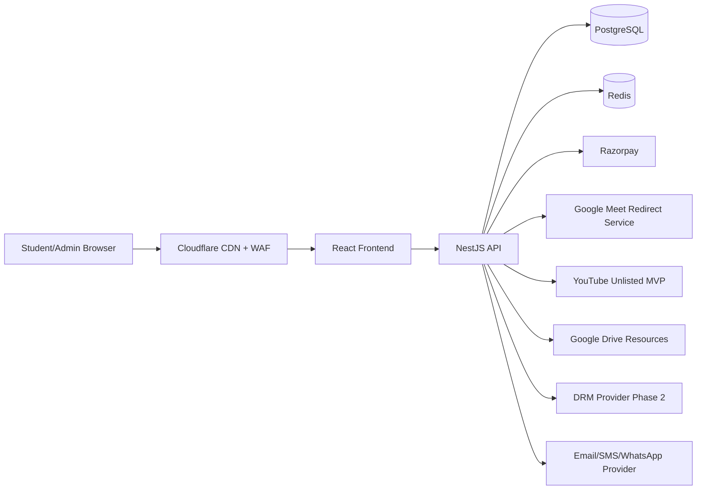

# Secure Udemy-Style LMS Master Plan (PERN)

## 1) Product Requirements Document (PRD)

### Vision
Build a production-grade LMS for India-based trainer businesses with strong practical security, installment-enabled payments, robust analytics, and trainer-led engagement workflows.

### Personas
- Student: consumes courses, attends live classes, attempts quizzes, pays via Indian payment rails.
- Trainer: creates curriculum, moderates Q&A, publishes announcements, tracks outcomes.
- Admin/Super Admin: governs users, courses, payments, analytics, fraud, and compliance.
- Support: handles tickets, due reminders, and operational issues.

### Business goals (12 months)
- Conversion: visitor-to-paid > 3%.
- Completion: average course completion > 55%.
- Refund rate: < 5% of captured payments.
- Installment collection: > 90% within due window.
- Churn reduction: inactivity nudges improve re-engagement by 15%.

### Non-functional requirements
- Availability target: 99.5% (MVP), 99.9% (growth).
- P95 page load: < 2.8s on 4G mobile.
- P95 API latency: < 350ms for read APIs.
- Security baseline: OWASP ASVS L2-like controls for web app.
- Data privacy: minimum required collection + retention policy.

## 2) Recommended Stack Decision With Cost Justification

### Final stack
- Frontend: React + TypeScript + Vite
- Backend: Node.js + NestJS (Express adapter)
- DB: PostgreSQL
- ORM: Prisma
- Cache/queue: Redis
- Auth: JWT access + refresh tokens (HttpOnly cookie option)
- Object storage: Cloudflare R2 or S3-compatible
- CDN/WAF: Cloudflare
- Payments: Razorpay
- Notifications: Email (Resend/SES) + SMS/WhatsApp (MSG91/Twilio/Gupshup)
- Observability: OpenTelemetry + lightweight APM/logs

### Why this is cost-optimal for Bangalore/India
- PostgreSQL handles transactions, installments, coupons, analytics rollups, and audits in one reliable system.
- Razorpay reduces payment integration complexity and supports UPI/cards/netbanking/wallets.
- Cloudflare + R2 minimizes bandwidth and egress costs.
- NestJS + Prisma accelerates maintainability for a small team.

### Cost phases
- MVP (0 to 5k MAU): Cloudflare Pages/Vercel (frontend), Railway/Render/Fly backend, managed Postgres (Neon/Supabase), Upstash Redis.
- Growth (5k to 50k MAU): move backend to dedicated VM/container service (DO/EC2), managed Postgres with read replica, Redis managed tier, queue workers.
- High scale (50k+ MAU): multi-AZ DB, dedicated Redis cluster, async analytics pipeline, CDN + edge auth checks, DRM video at scale.

## 3) System Architecture



### Key architectural choices
- Keep business logic server-side (coupon/installment/entitlement checks).
- Use signed lesson access and signed live-join redirect tokens.
- Store sensitive operational links only in backend DB.
- Emit event logs for watch, quiz, login, payment, and suspicious behavior.

## 4) DB Schema

- Prisma schema: see `backend/prisma/schema.prisma`
- SQL sample: see `backend/prisma/sql/sample_schema.sql`

### Includes requested tables
- users, user_profiles, roles, permissions, sessions, devices
- courses, course_categories, course_sections, lessons, lesson_videos, lesson_resources
- course_enrollments, course_progress, lesson_progress, watch_events
- quizzes, quiz_questions, quiz_options, quiz_attempts, quiz_answers
- live_sessions, live_session_attendees
- trainer_questions, trainer_answers, announcements
- coupons, coupon_redemptions
- orders, order_items, payments, payment_webhooks
- installment_plans, installment_schedules, installment_transactions
- refunds, invoices, certificates
- audit_logs, notifications, support_tickets, feature_flags
- practice_links, content_leak_flags

### Design highlights
- PK/FK integrity with `@@unique` and targeted indexes.
- Soft delete (`deletedAt`) on user/course/lesson.
- Reporting-ready date indexes for revenue and engagement queries.
- Audit trails with before/after JSON snapshots.

## 5) API Specification (REST)

Base: `/api/v1`

### Auth
- `POST /auth/register` public
- `POST /auth/login` public
- `POST /auth/refresh` refresh-token required
- `POST /auth/logout` authenticated

### Users/Profile
- `GET /users/me` authenticated
- `PATCH /users/me` authenticated
- `GET /admin/users` admin/support

### Courses/Sections/Lessons
- `GET /courses/public` public
- `GET /courses/:id` authenticated (enrollment gating for private data)
- `POST /courses` admin/trainer
- `POST /courses/:id/sections` admin/trainer
- `POST /sections/:id/lessons` admin/trainer
- `GET /lessons/:lessonId/player?courseId=...` enrolled student

### Enrollment/Progress/Watch events
- `POST /enrollments` authenticated
- `GET /progress/course/:courseId` enrolled student
- `POST /lessons/watch-events` enrolled student

### Quizzes
- `GET /quizzes/:quizId` enrolled student
- `POST /quizzes/:quizId/attempts` enrolled student
- `GET /quizzes/attempts/history` enrolled student

### Q&A and announcements
- `POST /qa/questions` enrolled student
- `POST /qa/questions/:id/answers` trainer/admin
- `GET /announcements/course/:courseId` enrolled student

### Live sessions
- `GET /live-sessions/:sessionId/join-token` enrolled student in time window
- `GET /live-sessions/join/resolve?token=...` signed token only

### Practice links
- `GET /practice-links/:courseId?lessonId=...` enrolled student

### Coupons/Orders/Payments
- `POST /coupons/validate` authenticated
- `POST /payments/orders` authenticated
- `POST /payments/webhooks/razorpay` webhook signature required
- `POST /refunds` admin/support

### Installments
- `POST /installments/preview` authenticated
- `GET /installments/my-schedule` authenticated
- `POST /installments/:id/pay` authenticated

### Analytics/Reports
- `GET /analytics/admin/summary` admin
- `GET /analytics/student/summary?studentId=...` authenticated
- `GET /admin/reports/revenue` admin
- `GET /admin/reports/engagement` admin
- `GET /admin/audit-logs` admin/super-admin

### Request/response conventions
- Validation: class-validator + zod for env/config and complex rule payloads.
- Response envelope:
  - success: `{ data, meta }`
  - error: `{ error: { code, message, details } }`
- Standard errors:
  - `400` validation
  - `401` auth missing/expired
  - `403` RBAC/enrollment blocked
  - `404` resource not found
  - `409` duplicate or state conflict
  - `429` rate limited
  - `500` unexpected server error

## 6) RBAC Matrix

| Feature | Super Admin | Admin | Trainer | Support | Student |
|---|---|---|---|---|---|
| Manage roles/permissions | Y | N | N | N | N |
| User lifecycle (suspend/reactivate) | Y | Y | N | Y (limited) | N |
| Create/edit courses | Y | Y | Y | N | N |
| Manage lessons/resources | Y | Y | Y | N | N |
| Manage coupons/installments | Y | Y | N | Y (limited) | N |
| Payment refunds | Y | Y | N | Y (workflow) | N |
| View all analytics/reports | Y | Y | limited | limited | N |
| Answer Q&A | Y | Y | Y | N | N |
| Ask Q&A | N | N | N | N | Y |
| Join live class | N | N | N | N | Y |
| Audit log export | Y | Y | N | N | N |

## 7) Security Architecture

### Core controls
- JWT access + refresh with rotation and revocation list.
- RBAC + enrollment checks on every protected lesson endpoint.
- Rate limiting for auth, coupon apply, checkout, and Q&A spam points.
- Helmet headers + strict CSP + CORS allowlist.
- Input validation and output encoding.
- Argon2 password hashing.
- Audit logging for admin-sensitive operations.
- Device/session tracking and concurrent session limit policy.
- Optional OTP re-verification for suspicious behavior.

### Data privacy
- Collect minimal PII.
- Encrypt sensitive fields at rest where needed (phone, billing details).
- Retention policy + right-to-delete workflow with legal exceptions.
- Consent and policy acceptance timestamps in profile.

## 8) Video Protection Strategy

### MVP (YouTube unlisted mode)
- Use authenticated lesson route, enrollment checks, and signed lesson sessions.
- Use `youtube-nocookie` embed and hide casual share affordances.
- Add moving forensic watermark overlays.
- Disable easy copy/context menu as deterrence only.

### Phase 2 (premium migration)
- Move premium courses to DRM provider (VdoCipher/Mux DRM/AWS DRM flow).
- Use short-lived playback tokens, geofence/IP policies, forensic watermarking.
- Add stronger anti-sharing heuristics and legal enforcement workflow.

## 9) Payment Architecture

### Flows
- One-time purchase via Razorpay order -> payment -> webhook reconciliation.
- Installment purchase -> plan + schedule -> due reminders -> retries.
- Coupon application before order creation with scope and limit checks.
- Refund lifecycle with audit and ledger updates.

### India-specific notes
- Razorpay supports UPI/cards/netbanking/wallets and BHIM UPI through gateway rails.
- GST invoice generation supported with invoice table + templated PDF pipeline.

## 10) Admin Analytics Specification

### Required dashboards
- Revenue: by month/year/course/payment method/coupon/installment status.
- Funnel: visitor -> lead -> checkout -> payment success.
- Learning: completion, drop-off, watch time, quiz outcomes.
- Risk: suspicious account sharing, login anomalies, refund abuse patterns.
- Collections: outstanding dues and aging buckets.

### Suggested aggregations
- Nightly rollups into summary tables for low-cost analytics queries.
- Real-time counters for core KPIs in Redis.

## 11) UI Sitemap

- Public: home, catalog, course detail, pricing, FAQ, blog, contact, login/register.
- Student: dashboard, my courses, lesson player, quizzes, Q&A, announcements, payments, installments, certificates, profile, notifications.
- Admin: users, courses, lessons, videos/resources, quizzes, live sessions, coupons, payments/refunds, installments, analytics, audit logs, leak flags, support tickets.

## 12) User Journeys

- Registration/login/OTP login.
- Browse -> checkout -> coupon apply -> payment -> enrollment.
- Lesson watch -> progress save -> quiz attempt -> certificate unlock.
- Join live class via signed backend redirect.
- Practice lab launch via per-course/lesson configured link.
- Admin reconciliation: webhook mismatch -> manual review -> ledger correction.

## 13) Wireframe Descriptions

- Home: high-intent hero, credibility strip, featured courses, social proof, CTA.
- Lesson Player: large player with curriculum sidebar, watermark overlay, notes/bookmark/actions panel.
- Checkout: simple summary card, coupon input, installment selector, Razorpay CTA.
- Admin Dashboard: KPI cards, trend charts, overdue dues table, suspicious events panel.

## 14) 12-Week Implementation Roadmap

- Week 1-2: repo setup, auth, RBAC, core entities, CI/CD, env strategy.
- Week 3-4: courses/sections/lessons, enrollment, progress, player shell.
- Week 5-6: quizzes/Q&A/announcements, notifications.
- Week 7-8: Razorpay one-time + coupon + webhook reconciliation.
- Week 9: installment plans, dues reminders, invoice generation.
- Week 10: admin analytics, reports export, audit logs.
- Week 11: live class signed redirects + anti-sharing signals + leak flags.
- Week 12: hardening, performance tuning, security tests, UAT launch.

## 15) MVP vs Phase 2 vs Phase 3

### MVP
- YouTube unlisted embed + enrollment controls + watermark.
- Core payments, coupons, installments, quizzes, analytics summary.

### Phase 2
- DRM for premium courses, deeper anti-sharing, cohort/drip release, affiliates.

### Phase 3
- Enterprise/team plans, advanced BI, recommendation engine, regional language variants.

## 16) Risk Register

| Risk | Likelihood | Impact | Mitigation |
|---|---|---|---|
| Content leakage | High | High | watermark + DRM migration + legal policy + leak monitoring |
| Payment webhook mismatch | Medium | High | idempotency keys + reconciliation job + alerting |
| Installment defaults | Medium | Medium | reminders + retry logic + temporary access policies |
| Admin misuse | Low | High | strict RBAC + immutable audit logs |
| Infra cost spikes | Medium | Medium | autoscaling guardrails + CDN caching + observability budgets |

## 17) Deployment Plan

- Environments: dev, staging, production.
- IaC template for infra baseline.
- Blue/green or rolling deploy backend.
- DB migration with prechecks and rollback scripts.
- Feature flags for risky rollouts.

## 18) Testing Plan

- Unit tests: coupon/installment/auth/rule engines.
- Integration tests: payment lifecycle, enrollment gating, live token flow.
- E2E tests: checkout, lesson watch, quiz, certificate.
- Security tests: auth abuse, RBAC bypass, rate-limit checks, input fuzzing.
- Performance tests: checkout peaks and analytics read load.

## 19) Sample SQL Schema

- See `backend/prisma/sql/sample_schema.sql`
- Use Prisma migrations as source of truth for production.

## 20) Sample Folder Structure (Implemented)

```text
backend/
  prisma/
    schema.prisma
    sql/sample_schema.sql
  src/
    modules/
      auth/
      courses/
      lessons/
      payments/
      coupons/
      installments/
      analytics/
      live-sessions/
      practice-links/
frontend/
  src/
    components/
    pages/admin/
    pages/public/
    pages/student/
    lib/
    styles/
docs/
  MASTER_PLAN.md
infra/
  docker-compose.yml
```

## What cannot be fully prevented in a web LMS

- Screen recording cannot be fully blocked in browser apps.
- Screenshots cannot be fully blocked in browser apps.
- Screen sharing cannot be fully blocked in browser apps.
- YouTube unlisted is not true premium-content protection.
- Google Meet links cannot be made absolutely unshareable once a user reaches Google Meet.

## Best practical mitigation strategy

- Move premium courses to DRM hosting with tokenized short-lived playback URLs.
- Keep strict server-side entitlement checks and signed lesson access sessions.
- Apply dynamic forensic watermark overlay for traceability.
- Enforce concurrent session limits and suspicious behavior detection.
- Use OTP re-verification for risky session/device patterns.
- Keep immutable audit logs for sensitive admin/payment actions.
- Add legal anti-sharing terms, graduated enforcement, and refund abuse controls.
- Continue YouTube-unlisted only as temporary MVP mode.

## Business extras recommended

- Referral and affiliate tracking.
- Waitlist and lead capture forms.
- Abandoned cart reminders via email/WhatsApp.
- Student segmentation + drip campaigns.
- Cohort-based batch scheduling.
- Bulk enrollment and enterprise/team access.
- Student inactivity nudges and reactivation workflows.
